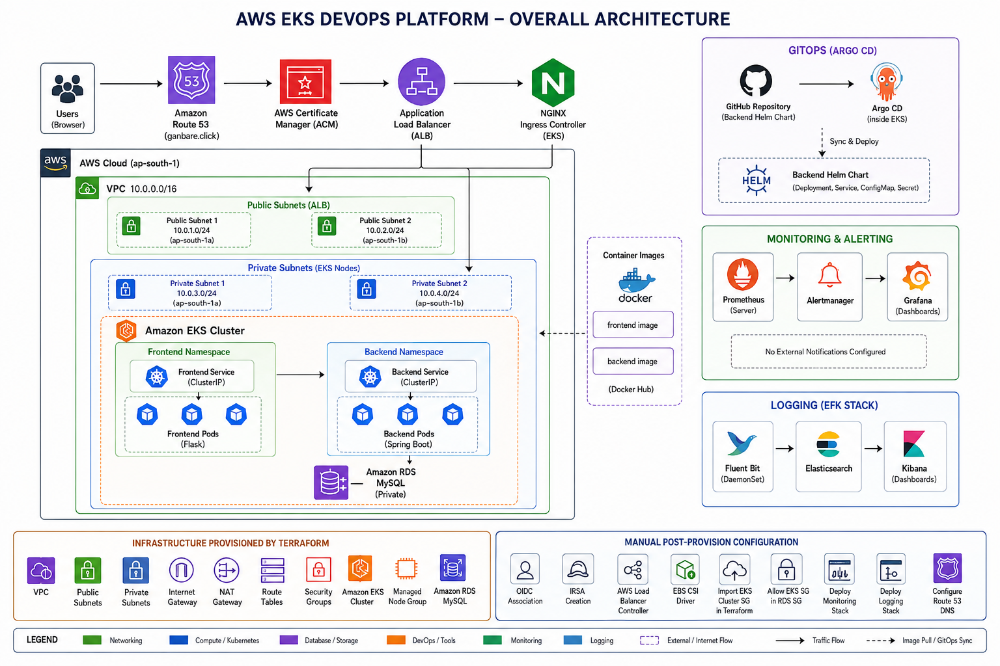

# Architecture

## Overview

The AWS EKS DevOps Platform is designed as a production-style Kubernetes environment running on Amazon Web Services (AWS). The infrastructure is provisioned using Terraform, applications are containerized with Docker, and workloads are orchestrated using Amazon Elastic Kubernetes Service (Amazon EKS).

The platform incorporates infrastructure provisioning, application deployment, GitOps, monitoring, alerting, centralized logging, persistent storage, and DNS management to provide a complete cloud-native deployment environment.

---

# Architecture Diagram



---

# Infrastructure Layer

The infrastructure is provisioned using Terraform and consists of the following AWS resources:

- Amazon VPC
- Public and Private Subnets across multiple Availability Zones
- Internet Gateway
- NAT Gateway
- Route Tables
- Security Groups
- Amazon EKS Cluster
- Amazon EKS Managed Node Group
- Amazon RDS MySQL Database

This provides a secure and highly available foundation for the Kubernetes platform.

---

# Kubernetes Layer

Amazon EKS hosts the containerized application and platform services.

The Kubernetes cluster includes:

- Backend Namespace
- Frontend Namespace
- Deployments
- Services
- ConfigMaps
- Secrets
- Ingress Resources
- Helm Charts

The backend application is packaged using Helm, while the frontend is deployed using Kubernetes manifests.

---

# Application Layer

The application consists of two components.

## Frontend

- Python Flask application
- Runs inside Kubernetes Pods
- Exposed through the NGINX Ingress Controller

## Backend

- Java Spring Boot application
- Connects to Amazon RDS MySQL
- Managed using a Helm chart

Application container images are stored in Docker Hub and pulled by Kubernetes during deployment.

---

# Networking

External traffic enters the platform through Amazon Route 53 DNS.

The request flow is:

```

User
↓
Amazon Route 53
↓
AWS Application Load Balancer
↓
NGINX Ingress Controller
↓
Frontend Service
↓
Frontend Pods
↓
Backend Service
↓
Backend Pods
↓
Amazon RDS MySQL

```

This architecture provides centralized traffic management and application routing.

---

# GitOps

GitOps is implemented for the backend application using Argo CD.

The backend Helm chart is stored in the GitHub repository.

Argo CD continuously monitors the repository and automatically synchronizes changes to the Kubernetes cluster, ensuring that the deployed application always matches the desired state stored in Git.

---

# Monitoring & Alerting

The monitoring stack consists of:

- Prometheus
- Grafana
- Alertmanager

Prometheus collects metrics from Kubernetes components and application workloads.

Grafana visualizes the collected metrics using dashboards.

Alertmanager manages alerts generated from Prometheus alert rules.

A custom alert was implemented to detect backend application downtime and validated by intentionally stopping the backend deployment.

---

# Centralized Logging

Centralized logging is implemented using the EFK stack.

Components include:

- Fluent Bit
- Elasticsearch
- Kibana

Fluent Bit collects container logs from Kubernetes nodes and forwards them to Elasticsearch.

Elasticsearch stores and indexes the logs.

Kibana provides a web interface for searching and visualizing application logs.

---

# Persistent Storage

Persistent storage is provided using the Amazon EBS CSI Driver.

The platform uses:

- StorageClass
- PersistentVolumeClaim (PVC)

Amazon EBS volumes are dynamically provisioned for workloads requiring persistent storage.

---

# Security

The platform incorporates multiple AWS security services and Kubernetes security mechanisms.

These include:

- IAM Roles
- Security Groups
- AWS Certificate Manager (ACM)
- Kubernetes Secrets
- Private Amazon RDS deployment

Network communication between Amazon EKS and Amazon RDS is controlled using Security Groups.

---

# DNS

Amazon Route 53 provides DNS management for services exposed through the NGINX Ingress Controller.

Configured endpoints include:

- Frontend Application
- Argo CD
- Grafana
- Prometheus
- Alertmanager
- Kibana

The services are accessible through custom subdomains under the **ganbare.click** domain.

---

# Summary

This platform demonstrates a production-style Kubernetes deployment on AWS by combining Infrastructure as Code, container orchestration, GitOps, monitoring, alerting, centralized logging, persistent storage, and DNS management into a single end-to-end DevOps solution.
